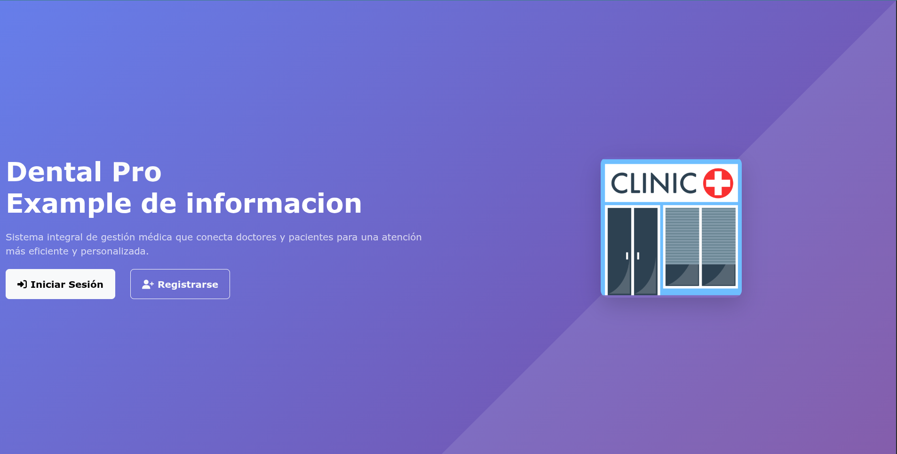
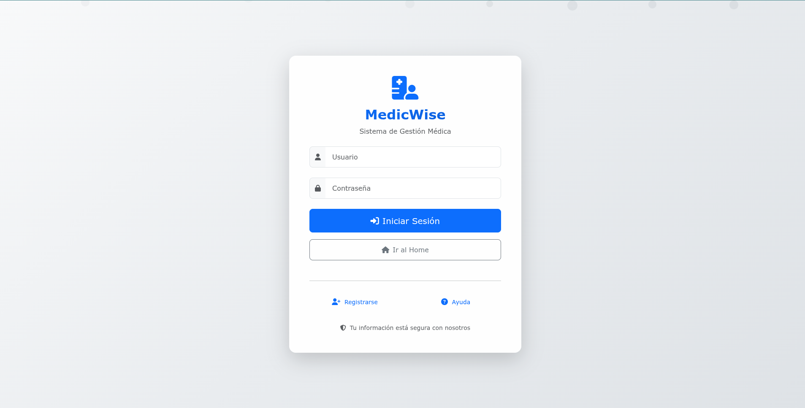
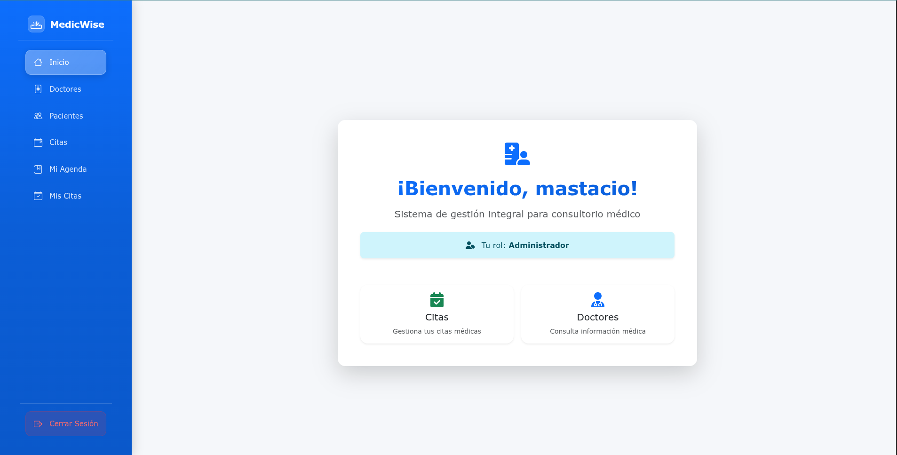

# 🏥 ClínicaFácil - Sistema de Gestión Médica

[](https://www.djangoproject.com/)
[](https://www.python.org/)
[](https://getbootstrap.com/)
[](LICENSE)

**ClínicaFácil** es un sistema integral de gestión médica desarrollado en Django que permite a clínicas y consultorios médicos administrar pacientes, doctores, citas y gestionar consultas médicas de manera eficiente y profesional.

## 📸 Capturas de Pantalla

### 🏠 Página Principal


### 👥 Login


### 🏥 Pagina de inicio


## ✨ Características Principales

### 👥 Gestión de Usuarios
- **Sistema de roles**: Administradores, Doctores y Pacientes
- **Autenticación segura** con modelo de usuario personalizado
- **Perfiles completos** para doctores y pacientes
- **Interfaz responsive** adaptada para móviles y PC

### 🏥 Gestión de Doctores
- Registro y gestión de perfiles médicos
- Especialidades y licencias médicas
- Horarios de trabajo configurables
- Calendario personal de citas

### 👤 Gestión de Pacientes
- Registro completo de pacientes
- Perfiles detallados tipo CV
- Historial médico integrado
- Información de contacto y emergencia

### 📅 Sistema de Citas
- **Calendario interactivo** con FullCalendar.js
- **Gestión de horarios** por doctor
- **Estados de citas**: Pendiente, Confirmada, Completada, Cancelada
- **Filtros avanzados** por fecha, estado, paciente y doctor
- **Modal de creación** con cálculo automático de duración

### 📋 Módulo de Gestión Médica
- **Gestión de consultas** con diagnóstico y observaciones
- **Prescripción de medicamentos** con dosis y frecuencia
- **Solicitud de análisis** con instrucciones específicas
- **Estados de seguimiento** para medicamentos y análisis
- **Historial completo** de tratamientos

### 🏥 Base de Datos Médica
- **47 Especialidades Médicas** con descripciones detalladas
- **58 Medicamentos** con dosis y presentaciones
- **64 Análisis Médicos** con instrucciones de preparación
- **Datos reales** y médicamente precisos
- **Categorización completa** por tipos y especialidades

### 📱 Formularios Responsivos
- **Diseño adaptativo** para móviles, tablets y desktop
- **Select2** para campos de búsqueda avanzada
- **Layout mejorado** con cards separadas por secciones
- **Iconos descriptivos** para mejor UX
- **Validación visual** con mensajes de error mejorados
- **Botones responsivos** que se apilan en móviles

### 🖨️ Sistema de Impresión
- **Prescripciones médicas** profesionales
- **Solicitudes de análisis** con formato oficial
- **Configuración de timbrado** y firmas digitales
- **Límite configurable** de elementos por impresión
- **Apertura automática** del diálogo de impresión

### 📊 Dashboard y Estadísticas
- **Estadísticas en tiempo real** de citas
- **Filtros dinámicos** en agenda médica
- **Vista de agenda** personalizada por doctor
- **Gestión de estados** con confirmaciones

## 🚀 Tecnologías Utilizadas

### Backend
- **Django 5.2.4** - Framework web principal
- **Python 3.11** - Lenguaje de programación
- **SQLite** - Base de datos (configurable para producción)
- **Pillow** - Procesamiento de imágenes

### Frontend
- **Bootstrap 5.3.2** - Framework CSS responsive
- **Font Awesome 6.0** - Iconografía profesional
- **FullCalendar.js** - Calendario interactivo
- **Select2** - Campos de búsqueda avanzada
- **Vanilla JavaScript** - Funcionalidades dinámicas

### Características Técnicas
- **Arquitectura MVC** bien estructurada
- **Sistema de templates** con herencia
- **Formularios dinámicos** con validación
- **Formularios responsivos** optimizados para móviles
- **Select2** para campos de búsqueda avanzada
- **AJAX** para interacciones asíncronas
- **Responsive design** para todos los dispositivos

## 📦 Instalación

### Prerrequisitos
- Python 3.11 o superior
- pip (gestor de paquetes de Python)
- Git

### Pasos de Instalación

1. **Clonar el repositorio**
```bash
git clone https://github.com/tu-usuario/clinicafacil.git
cd clinicafacil
```

2. **Crear entorno virtual**
```bash
python -m venv venv
source venv/bin/activate  # En Windows: venv\Scripts\activate
```

3. **Instalar dependencias**
```bash
pip install django==5.2.4
pip install Pillow
```

4. **Configurar la base de datos**
```bash
python manage.py makemigrations
python manage.py migrate
```

5. **Crear superusuario**
```bash
python manage.py createsuperuser
```

6. **Poblar datos de ejemplo**
```bash
python manage.py poblar_datos
python manage.py poblar_configuracion_impresion
```

7. **Poblar datos médicos (Opcional)**
```bash
# Poblar especialidades médicas
python manage.py poblar_especialidades

# Poblar medicamentos
python manage.py poblar_medicamentos

# Poblar análisis médicos
python manage.py poblar_analisis
```

8. **Ejecutar el servidor**
```bash
python manage.py runserver
```

9. **Acceder a la aplicación**
- URL: http://127.0.0.1:8000
- Admin: http://127.0.0.1:8000/admin

## 🏗️ Estructura del Proyecto

```
ClínicaFácil/
├── core/                     # Configuración principal de Django
│   ├── settings.py          # Configuraciones del proyecto
│   ├── urls.py              # URLs principales
│   └── wsgi.py              # Configuración WSGI
├── users/                    # Aplicación de usuarios
│   ├── models.py            # Modelo de usuario personalizado
│   ├── views.py             # Vistas de autenticación
│   └── templates/           # Templates de usuarios
├── doctores/                # Gestión de doctores
│   ├── models.py            # Modelo DoctorPerfil
│   ├── views.py             # Vistas de doctores
│   ├── management/          # Comandos de gestión de datos
│   │   └── commands/        # Comandos personalizados
│   │       └── poblar_especialidades.py
│   └── templates/           # Templates de doctores
├── pacientes/               # Gestión de pacientes
│   ├── models.py            # Modelo PacientePerfil
│   ├── views.py             # Vistas de pacientes
│   └── templates/           # Templates de pacientes
├── citas/                   # Sistema de citas
│   ├── models.py            # Modelo Cita y HorarioDoctor
│   ├── views.py             # Vistas de citas y agenda
│   └── templates/           # Templates de citas
├── gestion/                 # Módulo de gestión médica
│   ├── models.py            # Modelos de gestión y medicamentos
│   ├── views.py             # Vistas de gestión
│   ├── forms.py             # Formularios de gestión
│   ├── management/          # Comandos de gestión de datos
│   │   └── commands/        # Comandos personalizados
│   │       ├── poblar_medicamentos.py
│   │       └── poblar_analisis.py
│   └── templates/           # Templates de gestión
├── static/                  # Archivos estáticos
│   ├── css/                 # Estilos CSS
│   │   └── form-responsive.css  # Estilos responsivos para formularios
│   ├── js/                  # JavaScript
│   └── images/              # Imágenes
├── media/                   # Archivos subidos por usuarios
├── templates/               # Templates base
└── manage.py               # Script de gestión de Django
```

## 🎯 Funcionalidades por Módulo

### 👤 Usuarios (`users/`)
- **Autenticación** con modelo personalizado
- **Sistema de roles** (admin, doctor, paciente)
- **Menú lateral responsive** con navegación
- **Perfiles de usuario** con información detallada

### 🏥 Doctores (`doctores/`)
- **Registro de doctores** con especialidades
- **Gestión de horarios** por día de la semana
- **Perfiles médicos** con licencias y experiencia
- **Filtros y búsqueda** avanzada

### 👤 Pacientes (`pacientes/`)
- **Registro de pacientes** con datos completos
- **Perfiles tipo CV** con información detallada
- **Historial médico** integrado
- **Gestión de contactos** y emergencias

### 📅 Citas (`citas/`)
- **Calendario interactivo** con FullCalendar.js
- **Creación de citas** con modal dinámico
- **Gestión de horarios** por doctor
- **Agenda médica** con filtros avanzados
- **Estados de citas** (pendiente, confirmada, completada, cancelada)

### 📋 Gestión (`gestion/`)
- **Gestión de consultas** médicas
- **Prescripción de medicamentos** con dosis
- **Solicitud de análisis** con instrucciones
- **Sistema de impresión** profesional
- **Configuración de timbrado** y firmas

## 🔧 Configuración Avanzada

### Configuración de Impresión
1. Acceder al admin de Django
2. Ir a "Configuraciones de Impresión"
3. Crear una configuración activa
4. Subir archivos de timbrado, firma y sello
5. Configurar información de la clínica

### Personalización de Estilos
- Los estilos están en `static/css/`
- Variables CSS en `templates/base.html`
- Componentes Bootstrap personalizados

### Base de Datos
- **Desarrollo**: SQLite (incluida)
- **Producción**: PostgreSQL recomendado
- **Migraciones**: Automáticas con Django

## 🔧 Mejoras Técnicas Implementadas

### 📱 Responsividad de Formularios
- **Estructura adaptativa** con `col-12 col-lg-6` para diferentes pantallas
- **Cards separadas** para organizar información por secciones
- **Botones responsivos** con `flex-column flex-sm-row`
- **Iconos descriptivos** para mejorar la experiencia de usuario
- **Select2** implementado en todos los campos select relevantes

### 🎨 Estilos CSS Responsivos
- **Archivo `form-responsive.css`** con media queries específicas
- **Optimizaciones para móviles** (max-width: 768px)
- **Mejoras para tablets** (769px - 1024px)
- **Select2 personalizado** para diferentes tamaños de pantalla
- **Validación visual** mejorada con iconos y colores

### 📊 Datos Médicos Completos
- **Comandos de gestión** para poblar datos automáticamente
- **Datos reales** y médicamente precisos
- **Categorización completa** por especialidades y tipos
- **Información detallada** con descripciones y preparaciones

## 🚀 Despliegue en Producción

### Configuración de Seguridad
```python
# settings.py
DEBUG = False
ALLOWED_HOSTS = ['tu-dominio.com']
SECRET_KEY = 'tu-clave-secreta-segura'
```

### Base de Datos de Producción
```python
DATABASES = {
    'default': {
        'ENGINE': 'django.db.backends.postgresql',
        'NAME': 'clinicafacil_db',
        'USER': 'tu_usuario',
        'PASSWORD': 'tu_password',
        'HOST': 'localhost',
        'PORT': '5432',
    }
}
```

### Archivos Estáticos
```bash
python manage.py collectstatic
```

## 📝 Comandos Útiles

### Gestión de Datos Médicos

El sistema incluye comandos especializados para poblar la base de datos con información médica real y precisa:

#### 🏥 Poblar Especialidades Médicas
```bash
python manage.py poblar_especialidades
```
**Incluye 47 especialidades:**
- Especialidades básicas (Medicina General, Pediatría)
- Especialidades quirúrgicas (Cirugía General, Cardiovascular)
- Especialidades médicas (Cardiología, Dermatología, Endocrinología)
- Especialidades diagnósticas (Radiología, Patología)
- Especialidades modernas (Medicina del Deporte, Medicina Integrativa)

#### 💊 Poblar Medicamentos
```bash
python manage.py poblar_medicamentos
```
**Incluye 58 medicamentos:**
- Analgésicos (Paracetamol, Ibuprofeno, Diclofenaco)
- Antibióticos (Amoxicilina, Ciprofloxacino, Azitromicina)
- Antihipertensivos (Losartán, Valsartán, Amlodipino)
- Antidiabéticos (Metformina, Glimepirida, Sitagliptina)
- Antidepresivos (Sertralina, Fluoxetina, Venlafaxina)
- Estatinas (Atorvastatina, Simvastatina, Rosuvastatina)
- Protectores gástricos (Omeprazol, Pantoprazol, Esomeprazol)

#### 🔬 Poblar Análisis Médicos
```bash
python manage.py poblar_analisis
```
**Incluye 64 análisis:**
- **Hematología:** Hemograma, VSG, Ferritina
- **Bioquímica:** Glucosa, Perfil Lipídico, Creatinina
- **Hormonales:** TSH, T4 Libre, Cortisol, Insulina
- **Tumorales:** PSA, CEA, CA 125, CA 19-9
- **Cardiología:** Troponina I, CPK, BNP, ECG
- **Coagulación:** Dímero D, TP, TTP, Fibrinógeno
- **Inmunología:** ANA, Factor Reumatoideo, Anti CCP
- **Infecciosas:** Hepatitis B/C, VIH, VDRL/RPR
- **Imagenología:** Radiografía, Tomografía, Resonancia
- **Especializados:** Polisomnografía, EEG, Densitometría

### Gestión de Datos
```bash
# Crear superusuario
python manage.py createsuperuser

# Poblar datos de ejemplo
python manage.py poblar_datos

# Configurar impresión
python manage.py poblar_configuracion_impresion

# Poblar datos médicos
python manage.py poblar_especialidades
python manage.py poblar_medicamentos
python manage.py poblar_analisis

# Crear migraciones
python manage.py makemigrations

# Aplicar migraciones
python manage.py migrate
```

### Desarrollo
```bash
# Ejecutar servidor de desarrollo
python manage.py runserver

# Ejecutar tests
python manage.py test

# Shell de Django
python manage.py shell
```

## 📄 Licencia

Este proyecto está bajo la Licencia MIT. Ver el archivo `LICENSE` para más detalles.

## 👨‍💻 Autor

**ClínicaFácil** - Sistema de Gestión Médica

- **Desarrollado con**: Django, Bootstrap, JavaScript
- **Versión**: 1.0.0
- **Fecha**: 2025

## 🙏 Agradecimientos

- **Django** por el excelente framework
- **Bootstrap** por los componentes responsive
- **Font Awesome** por los iconos profesionales
- **FullCalendar.js** por el calendario interactivo

---

**ClínicaFácil** - Transformando la gestión médica con tecnología moderna y profesional. 🏥✨ 
